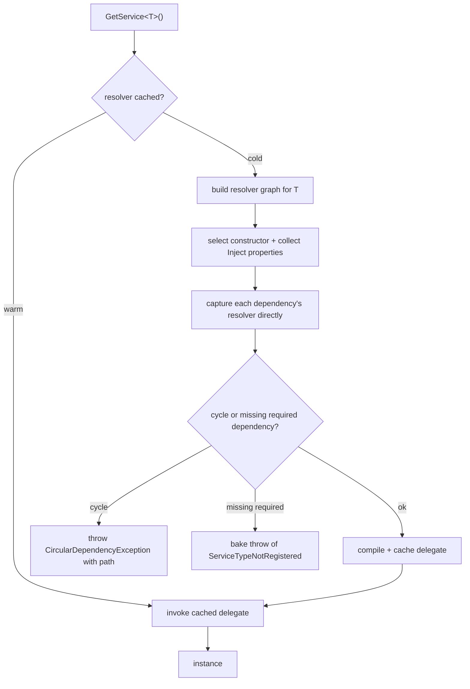
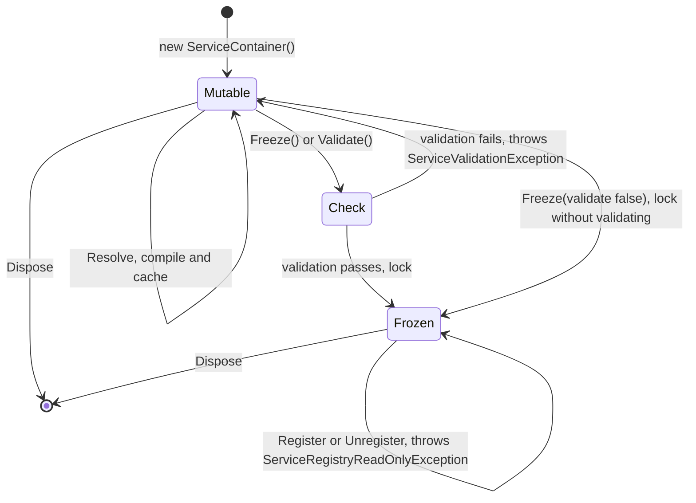

# Architecture

How `Snowberry.DependencyInjection` resolves services, and how the container moves from its default mutable
state into the opt-in frozen state. (The diagrams below use Mermaid and render on GitHub; this document is not
shipped in the NuGet package.)

## Resolution: the compiled resolver graph

Every resolve goes through a **compiled per-service resolver**, a `Func<scope, object?>` cached per service.
The first resolve of a type is *cold*: the container builds the resolver graph for that type, capturing each
dependency's resolver delegate directly so there is no per-argument re-dispatch, then compiles and caches a
delegate. Every resolve afterward is *warm*: a dictionary lookup plus a delegate call. Singletons are baked to
constants and scoped instances are read lock-free, so warm singleton/scoped resolves allocate nothing.

The graph is built eagerly over the resolved subtree, so structural problems surface as real exceptions rather
than late or fatal failures.

A registration change atomically invalidates the affected cached resolvers; they rebuild lazily on the next
resolve. This is what keeps dynamic add/remove correct while the container stays mutable.

## Container lifecycle: mutable → frozen

The container starts **mutable** and can be registered into, overwritten, and unregistered from at any time.
`Freeze()` is a one-way, idempotent transition into the **frozen** state. By default it validates the graph
first; if validation fails it throws and the container stays mutable.

### Mutable vs frozen

| | Mutable (default) | Frozen (`Freeze()`) |
| --- | --- | --- |
| Add / remove / overwrite | Yes | No, throws `ServiceRegistryReadOnlyException` |
| Resolver caching | Per-generation, invalidated on registration change | Permanent (no invalidation machinery) |
| Optimizations | Cached compiled resolvers, baked singletons, lock-free scoped reads | Above **plus** full-graph inlining of transient subtrees and optimized scope caches |
| Use when | You may reconfigure at runtime | Configuration is final and you want top speed |

Freezing only changes *how* resolution is compiled. Resolved instances, lifetimes, and disposal behavior are
identical to mutable mode.

## Lifetimes & disposal ownership

- **Singleton:** one instance per container, constructed against the root scope and disposed with the
  container.
- **Scoped:** one instance per scope, disposed when that scope is disposed. Resolving a scoped service
  directly from the container uses the container's own root scope.
- **Transient:** a new instance on every resolve, disposed by the scope that created it.

Instances **you** supply (`RegisterSingleton<T>(instance: ...)`) are never disposed by the container; instances
the container constructs are. Disposal is LIFO within each scope.
